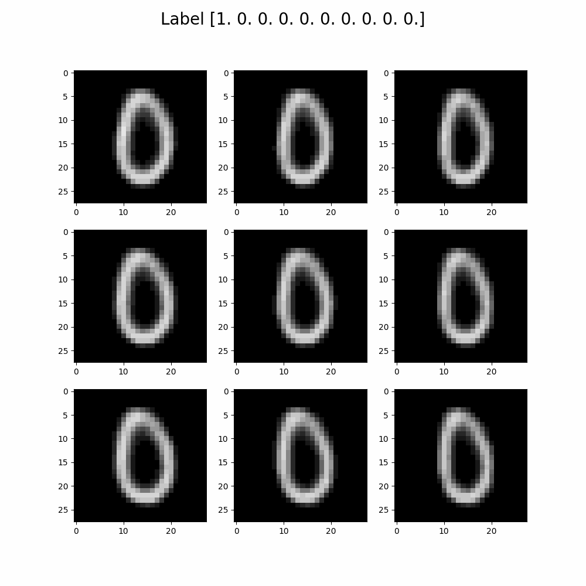

# MNIST Variational Autoencoders (VAEs) Project
- M Beekenkamp

## Overview

This repository contains an implementation of a Variational Autoencoder (VAE) applied to the MNIST dataset. A Variational Autoencoder is a generative model that learns a probabilistic mapping between input data and a latent space. In this implementation the VAE accurately reconstructs MNIST digits, with a reconstruction loss below 135, using Tensorflow.

### Example of VAE reconstruction

### Example of VAE latent space walk
